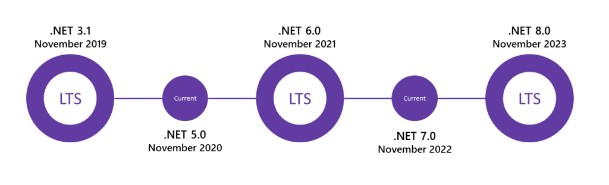
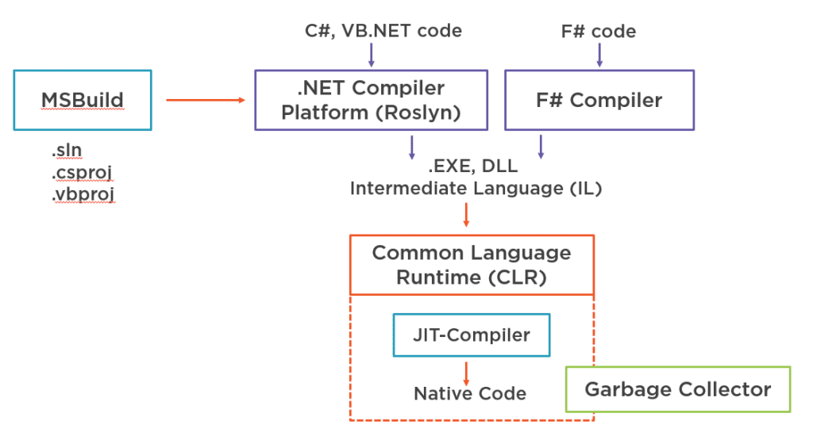
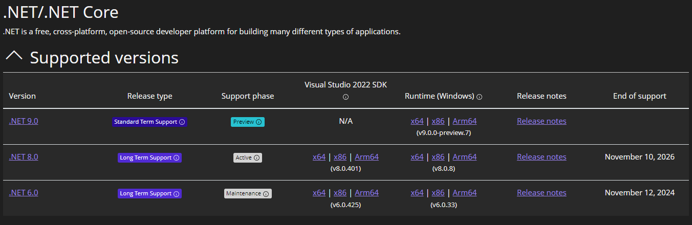
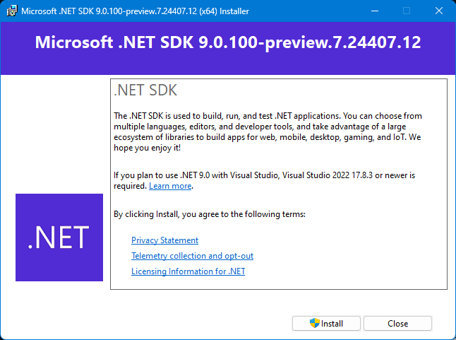
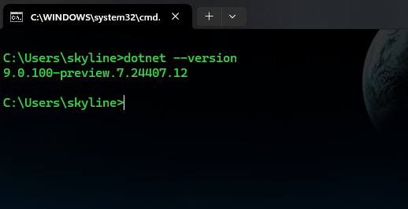
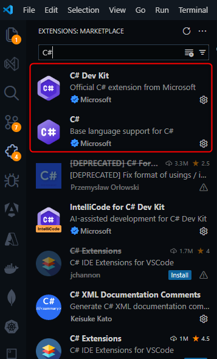

### **Pengenalan .NET**

#### **1. Apa itu .NET?**
.NET adalah platform pengembangan perangkat lunak yang dibuat oleh Microsoft, yang menyediakan lingkungan untuk membangun dan menjalankan berbagai jenis aplikasi, seperti aplikasi desktop, web, mobile, dan cloud. Platform ini terdiri dari berbagai teknologi, termasuk .NET Framework, .NET Core, dan versi terbaru seperti .NET 5, 6, 7, dan 8.

**Sejarah Singkat .NET:**




.NET pertama kali dirilis pada tahun 2002 dengan .NET Framework. Ini dirancang untuk membantu pengembang membangun aplikasi Windows. Seiring berjalannya waktu, Microsoft memperluas .NET menjadi platform lintas platform dengan memperkenalkan .NET Core pada tahun 2016. Pada tahun 2020, Microsoft merilis .NET 5, yang menyatukan .NET Framework dan .NET Core menjadi satu platform tunggal yang dikenal sebagai .NET.

**Tujuan Utama .NET:**
- **Portabilitas:** Aplikasi dapat berjalan di berbagai platform, termasuk Windows, macOS, dan Linux.
- **Produktivitas:** Menyediakan alat dan pustaka yang memudahkan pengembang untuk menulis, menguji, dan memelihara kode.
- **Kinerja:** Meningkatkan kecepatan dan efisiensi aplikasi dengan optimisasi pada runtime.

**Contoh:**
.NET digunakan untuk membangun aplikasi web menggunakan ASP.NET, aplikasi mobile menggunakan Xamarin, dan aplikasi desktop menggunakan Windows Forms atau WPF.

#### 2. **Gambaran Umum .NET Framework, .NET Core, dan .NET 5/6/7/8**

##### **1 .NET Framework**
.NET Framework adalah implementasi awal .NET yang hanya berfungsi di sistem operasi Windows. Ini digunakan secara luas untuk membangun aplikasi desktop dan server. .NET Framework mencakup teknologi seperti Windows Forms, WPF (Windows Presentation Foundation), dan ASP.NET untuk pengembangan aplikasi web.

##### **2 .NET Core**
.NET Core adalah versi lintas platform dari .NET, yang dapat berjalan di Windows, macOS, dan Linux. .NET Core menawarkan kinerja yang lebih baik dan lebih modular dibandingkan dengan .NET Framework. Ini memungkinkan pengembang untuk membangun aplikasi modern dengan kemampuan yang lebih baik dalam hal skalabilitas dan portabilitas.

##### **3 .NET 5, 6, 7, dan 8**
.NET 5 adalah versi pertama dari .NET yang menyatukan .NET Core dan .NET Framework menjadi satu platform tunggal. Versi ini diikuti oleh .NET 6, 7, dan 8, yang terus mengembangkan dan meningkatkan kemampuan .NET, menawarkan dukungan jangka panjang (LTS) dan peningkatan kinerja serta fitur-fitur terbaru.

**Contoh:**
Pengembang dapat menggunakan .NET 6 untuk membangun aplikasi web modern dengan ASP.NET Core, aplikasi desktop dengan .NET MAUI, atau aplikasi API dengan microservices.

#### **3. Memahami CLR (Common Language Runtime)**

##### **1 Apa itu CLR?**
CLR (Common Language Runtime) adalah jantung dari .NET. Ini adalah mesin virtual yang mengelola eksekusi kode .NET, menyediakan layanan seperti manajemen memori, penanganan eksepsi, dan keamanan.



#### **Fungsi Utama CLR:**
- **Manajemen Memori:** CLR otomatis mengelola alokasi dan dealokasi memori, mencegah kebocoran memori.
- **Garbage Collection:** Membersihkan objek yang tidak lagi digunakan untuk membebaskan memori.
- **Keamanan:** Menyediakan mekanisme untuk memastikan bahwa kode yang dijalankan aman dan tidak melakukan tindakan yang tidak sah.
- **Eksekusi Kode:** Menyediakan lingkungan untuk menjalankan kode yang telah dikompilasi menjadi MSIL (Microsoft Intermediate Language).

**Contoh:**
Ketika Anda menjalankan aplikasi .NET, kode sumber Anda dikompilasi menjadi MSIL, yang kemudian dijalankan oleh CLR di lingkungan eksekusi yang terkelola.

```csharp
using System;

class Program
{
    static void Main()
    {
        Console.WriteLine("Hello, .NET!");
    }
}
```

Pada contoh di atas, kode C# ini akan dikompilasi menjadi MSIL, yang kemudian dieksekusi oleh CLR.

#### **4. .NET Standard dan Kompatibilitasnya**

##### **1. Apa itu .NET Standard?**
.NET Standard adalah spesifikasi yang mendefinisikan serangkaian API (Application Programming Interface) yang harus tersedia di semua implementasi .NET. Implementasi .NET ini meliputi .NET Framework, .NET Core, dan Xamarin, serta versi terbaru seperti .NET 5, 6, 7, dan 8. Dengan menggunakan .NET Standard, pengembang dapat membuat pustaka kode yang kompatibel dengan berbagai platform .NET tanpa perlu mengubah kode.

**Tujuan dan Manfaat .NET Standard:**
- **Kompatibilitas Lintas Platform:** Pustaka yang dibuat dengan .NET Standard dapat digunakan di berbagai implementasi .NET.
- **Mudah Dikelola:** Pengembang dapat membuat satu pustaka kode yang dapat digunakan kembali di berbagai platform.

##### **2. Versi .NET Standard**
.NET Standard memiliki beberapa versi, di mana setiap versi mencakup set API yang lebih besar dibandingkan versi sebelumnya. Semakin tinggi versi .NET Standard yang Anda gunakan, semakin besar API yang didukung, tetapi semakin sedikit platform yang kompatibel.

**Contoh:**
Misalkan Anda menulis pustaka matematika sederhana yang ingin digunakan di aplikasi web (berbasis .NET Core) dan aplikasi mobile (berbasis Xamarin). Dengan mematuhi .NET Standard 2.0, pustaka ini dapat digunakan di kedua platform tersebut tanpa perubahan.

```csharp
public class MathLibrary
{
    public int Add(int a, int b)
    {
        return a + b;
    }
}
```

#### **5. Menginstal .NET SDK dan Visual Studio**

##### **1. Menginstal .NET SDK**
.NET SDK (Software Development Kit) adalah paket perangkat lunak yang diperlukan untuk membangun aplikasi menggunakan .NET. SDK ini mencakup kompilator, runtime, dan alat-alat lainnya yang diperlukan untuk mengembangkan dan menjalankan aplikasi .NET.

**Langkah-langkah Menginstal .NET SDK:**
1. **Kunjungi Situs Resmi .NET:**

   
   - Buka [situs resmi .NET](https://dotnet.microsoft.com/download).
   - Pilih versi .NET SDK yang ingin Anda instal (misalnya, .NET 6).
   
2. **Unduh SDK:**
   - Klik tautan unduhan yang sesuai dengan sistem operasi Anda (Windows, macOS, atau Linux).
   - Unduh file installer.

3. **Jalankan Installer:**

   

   - Setelah unduhan selesai, buka file installer.
   - Ikuti petunjuk di layar untuk menyelesaikan instalasi. Biasanya, ini melibatkan persetujuan lisensi dan memilih direktori instalasi.

4. **Verifikasi Instalasi:**

   

   - Setelah instalasi selesai, buka Command Prompt atau Terminal.
   - Ketik perintah `dotnet --version` dan tekan Enter untuk memastikan bahwa SDK telah terinstal dengan benar.
   - Output harus menampilkan versi .NET yang telah Anda instal, misalnya `6.0.100`.

##### **2. Menginstal Visual Studio**
Visual Studio adalah IDE (Integrated Development Environment) yang kuat dan populer untuk pengembangan aplikasi .NET. Ini mencakup banyak alat dan fitur yang membantu Anda dalam menulis, mengelola, dan mendebug kode dengan efisien.

**Langkah-langkah Menginstal Visual Studio:**
1. **Unduh Visual Studio:**
   - Kunjungi [situs resmi Visual Studio](https://visualstudio.microsoft.com/downloads/).
   - Pilih edisi yang sesuai (misalnya, Visual Studio Community, Professional, atau Enterprise).
   - Klik "Free download" untuk memulai unduhan.

2. **Jalankan Installer:**
   - Setelah unduhan selesai, buka file installer Visual Studio.
   - Installer akan mengunduh komponen tambahan yang diperlukan, jadi pastikan Anda terhubung ke internet.

3. **Pilih Workloads:**

   

   - Saat diminta, pilih workloads yang Anda butuhkan. Untuk pengembangan .NET, pilih:
     - **ASP.NET and web development:** Untuk membangun aplikasi web menggunakan ASP.NET Core.
     - **Desktop development with .NET:** Untuk membangun aplikasi desktop menggunakan Windows Forms atau WPF.
     - **.NET Core cross-platform development:** Untuk mengembangkan aplikasi .NET Core lintas platform.
   - Anda juga dapat memilih workloads tambahan berdasarkan kebutuhan Anda.

4. **Instal dan Mulai:**
   - Setelah Anda memilih workloads, klik "Install" untuk memulai instalasi.
   - Instalasi ini mungkin memakan waktu, tergantung pada jumlah workloads yang Anda pilih.
   - Setelah selesai, buka Visual Studio dan Anda siap untuk memulai pengembangan aplikasi .NET.

#### **6. Menginstal .NET SDK dan Visual Studio Code**

##### **1. Menginstal .NET SDK**
Proses instalasi .NET SDK pada langkah ini sama seperti yang telah dijelaskan di atas.

##### **2. Menginstal Visual Studio Code**
Visual Studio Code (VS Code) adalah editor kode sumber yang ringan namun sangat kuat, yang mendukung berbagai bahasa pemrograman dan dapat diperluas dengan ekstensi. Ini adalah pilihan yang bagus untuk pengembang yang lebih suka editor ringan namun fungsional untuk pengembangan .NET.

**Langkah-langkah Menginstal Visual Studio Code:**
1. **Unduh Visual Studio Code:**
   - Kunjungi [situs resmi Visual Studio Code](https://code.visualstudio.com/).
   - Klik "Download" dan pilih sistem operasi Anda (Windows, macOS, atau Linux).

2. **Jalankan Installer:**
   - Setelah unduhan selesai, buka file installer VS Code.
   - Ikuti petunjuk di layar untuk menyelesaikan instalasi.

3. **Mulai VS Code:**
   - Setelah instalasi selesai, buka Visual Studio Code.

##### **3. Menginstal Ekstensi C#**
1. **Buka Menu Ekstensi:**
   - Klik ikon Extensions di sidebar kiri VS Code (ikon berbentuk kotak).
   
2. **Cari Ekstensi C#:**

   

   - Di kotak pencarian, ketik "C#" dan pilih ekstensi yang dibuat oleh Microsoft.
   - Klik "Install" untuk menginstal ekstensi C#.

3. **Konfigurasi VS Code untuk Pengembangan .NET:**
   - Setelah ekstensi terinstal, VS Code akan mendukung penyorotan sintaks, IntelliSense, dan debugging untuk C# dan proyek .NET.
   - Anda sekarang dapat memulai proyek .NET di VS Code menggunakan perintah `dotnet` di terminal bawaan.

**Contoh:**
Misalkan Anda ingin membuat aplikasi .NET menggunakan VS Code. Berikut adalah langkah-langkahnya:
1. Buka terminal di VS Code (`Ctrl + `).
2. Buat proyek baru dengan mengetik perintah:

   ```bash
   dotnet new console -n MyFirstApp
   ```

3. Buka folder proyek dengan memilih **File > Open Folder** di VS Code.
4. Mulailah menulis kode di file `Program.cs`.