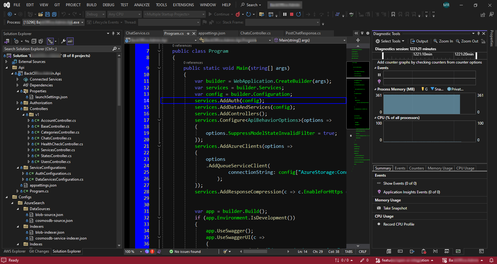
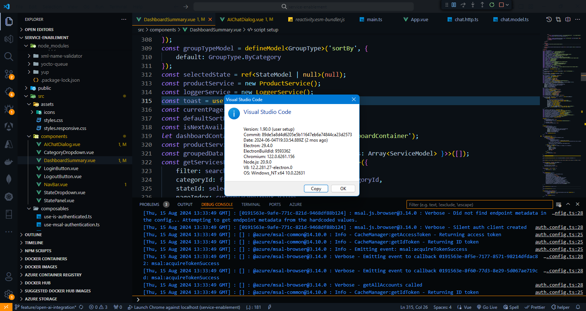
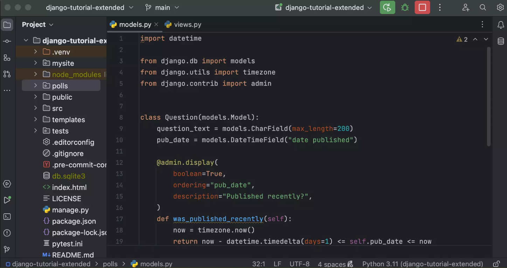
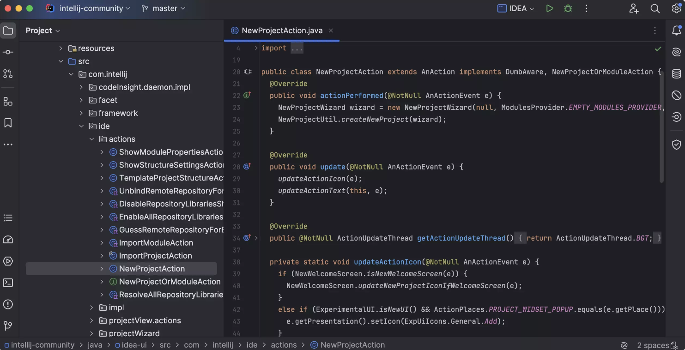

### **1. Pengenalan Pemrograman**

#### **1.1 Apa itu Pemrograman?**

1. **Definisi Pemrograman**
   - **Pemrograman** adalah proses menulis serangkaian instruksi, yang disebut kode, yang memberitahu komputer bagaimana melakukan tugas tertentu. Bayangkan komputer sebagai alat yang sangat pintar, tetapi tidak bisa melakukan apa-apa tanpa instruksi yang jelas. Pemrograman adalah cara kita memberikan instruksi-instruksi itu kepada komputer. Instruksi-instruksi ini ditulis dalam bahasa pemrograman yang dapat dipahami oleh komputer.

   - Pada dasarnya, setiap program komputer adalah sekumpulan instruksi yang menjalankan tugas tertentu, seperti menampilkan gambar di layar, menghitung angka, atau bahkan mengendalikan robot. Pemrograman memungkinkan kita menciptakan aplikasi seperti kalkulator, game, aplikasi perbankan, dan banyak lagi.

   **Contoh:**
   Misalkan kita ingin membuat program yang hanya mencetak teks “Hello, World!” di layar komputer. Berikut adalah contoh bagaimana ini ditulis dalam bahasa pemrograman C#:

   ```csharp
   using System;

   class Program
   {
       static void Main(string[] args)
       {
           Console.WriteLine("Hello, World!");
       }
   }
   ```

   **Penjelasan:**
   - **using System;**: Mengimpor namespace `System` yang menyediakan kelas dan metode dasar seperti `Console`.
   - **class Program**: Mendefinisikan sebuah kelas bernama `Program`, yang merupakan wadah untuk kode kita.
   - **static void Main(string[] args)**: Ini adalah titik masuk utama program. Ketika program dijalankan, metode `Main` akan dipanggil pertama kali.
   - **Console.WriteLine("Hello, World!");**: Mencetak teks "Hello, World!" ke layar. `Console.WriteLine` adalah cara untuk menampilkan output di konsol.

2. **Mengapa Pemrograman Penting?**
   - Pemrograman adalah keterampilan yang sangat penting di dunia modern karena hampir semua aspek kehidupan kita sekarang dipengaruhi oleh teknologi. Dengan pemrograman, kita bisa mengembangkan software untuk berbagai keperluan, mulai dari aplikasi mobile yang membantu kita dalam kehidupan sehari-hari, hingga sistem keamanan yang melindungi data sensitif. Pemrograman juga memungkinkan kita untuk mengotomatisasi tugas-tugas yang berulang, memecahkan masalah dengan efisiensi, dan bahkan menciptakan inovasi baru yang mengubah cara kita hidup dan bekerja.

   **Contoh:**
   Jika Anda ingin mengotomatisasi tugas harian seperti mengirim email pada waktu tertentu, Anda bisa membuat program sederhana yang menggunakan timer untuk mengirim email secara otomatis.

   ```csharp
   using System;
   using System.Timers;

   class Program
   {
       static void Main(string[] args)
       {
           Timer timer = new Timer(5000); // Set timer to trigger every 5 seconds
           timer.Elapsed += SendEmail;
           timer.Start();

           Console.WriteLine("Press Enter to exit...");
           Console.ReadLine();
       }

       private static void SendEmail(object source, ElapsedEventArgs e)
       {
           Console.WriteLine("Email sent at: " + DateTime.Now);
           // Logic to send email
       }
   }
   ```

   **Penjelasan:**
   - Program ini menggunakan `Timer` untuk memicu pengiriman email setiap 5 detik. Fungsi `SendEmail` akan dipanggil setiap kali timer mencapai 5 detik. Tentu saja, dalam aplikasi nyata, Anda akan menambahkan logika untuk benar-benar mengirim email.

3. **Bagaimana Pemrograman Bekerja?**
   - Pada tingkat dasar, pemrograman bekerja dengan memberi instruksi kepada komputer untuk memanipulasi data, membuat keputusan berdasarkan kondisi tertentu, dan mengulangi tugas tertentu hingga kondisi yang diinginkan tercapai. Komputer hanya mengerti instruksi yang sangat spesifik, jadi seorang programmer harus menulis kode dengan sangat teliti.

   - Sebagai contoh, bayangkan Anda ingin membuat program yang menghitung total nilai dalam sebuah kelas. Anda akan menulis kode yang:
     - Menyimpan nilai-nilai siswa dalam variabel.
     - Menjumlahkan nilai-nilai tersebut.
     - Menghitung rata-rata.
     - Menampilkan hasilnya.

   **Contoh:**
   ```csharp
   using System;

   class Program
   {
       static void Main(string[] args)
       {
           int[] nilai = { 85, 90, 78, 92, 88 };
           int total = 0;

           for (int i = 0; i < nilai.Length; i++)
           {
               total += nilai[i];
           }

           double rataRata = (double)total / nilai.Length;
           Console.WriteLine("Rata-rata nilai: " + rataRata);
       }
   }
   ```

   **Penjelasan:**
   - Program ini menyimpan nilai-nilai siswa dalam array `nilai`, menghitung totalnya dengan menjumlahkan setiap elemen array, dan kemudian membagi totalnya dengan jumlah siswa untuk mendapatkan rata-rata. Hasil akhirnya dicetak ke layar.

#### **1.2 Gambaran Umum Bahasa Pemrograman**

1. **Apa Itu Bahasa Pemrograman?**
   - Bahasa pemrograman adalah alat yang kita gunakan untuk menulis kode. Sama seperti bahasa manusia, bahasa pemrograman memiliki aturan tata bahasa dan struktur yang harus diikuti agar kode tersebut dapat dimengerti oleh komputer. Setiap bahasa pemrograman memiliki karakteristik dan tujuan penggunaan yang berbeda-beda.

   - Bahasa pemrograman memungkinkan kita untuk menerjemahkan logika dan algoritma yang kita miliki menjadi serangkaian instruksi yang dapat dijalankan oleh komputer. Contoh bahasa pemrograman populer meliputi C#, Python, Java, dan JavaScript.

2. **Jenis-Jenis Bahasa Pemrograman**
   - **Bahasa Tingkat Rendah (Low-Level Languages):** Bahasa ini berinteraksi langsung dengan hardware komputer dan memberikan kontrol penuh kepada programmer. Namun, bahasa ini lebih sulit dipelajari karena lebih dekat dengan kode mesin (contohnya adalah Assembly Language).

   - **Bahasa Tingkat Tinggi (High-Level Languages):** Bahasa ini lebih abstrak dan lebih mudah dipahami oleh manusia. Bahasa-bahasa ini menyembunyikan banyak detail teknis yang diperlukan untuk berinteraksi dengan hardware, sehingga lebih mudah digunakan untuk mengembangkan aplikasi kompleks. Contohnya adalah C#, Python, dan Java.

   **Contoh:**
   Mari kita lihat bagaimana C# (bahasa tingkat tinggi) memungkinkan kita menulis program yang relatif mudah dimengerti:

   ```csharp
   using System;

   class Program
   {
       static void Main(string[] args)
       {
           Console.WriteLine("Masukkan nama Anda: ");
           string nama = Console.ReadLine();
           Console.WriteLine("Halo, " + nama + "!");
       }
   }
   ```

   **Penjelasan:**
   - Program ini meminta pengguna untuk memasukkan nama mereka, lalu mencetak pesan sapaan dengan nama yang diberikan. Dengan C#, kita bisa dengan mudah menulis kode yang interaktif dan bermanfaat.

3. **Contoh Bahasa Pemrograman Populer**
   - **C#:** Digunakan untuk berbagai jenis aplikasi, termasuk aplikasi desktop, aplikasi web (dengan ASP.NET), dan pengembangan game (dengan Unity). C# adalah bahasa yang kuat dan serbaguna.
   - **Python:** Dikenal karena kesederhanaannya dan sering digunakan dalam data science, machine learning, pengembangan web, dan automasi.
   - **Java:** Banyak digunakan untuk pengembangan aplikasi mobile (Android) dan software enterprise.
   - **JavaScript:** Bahasa utama untuk pengembangan front-end web, juga banyak digunakan di back-end dengan framework seperti Node.js.

   **Contoh:**
   Berikut adalah perbandingan sederhana bagaimana dua bahasa pemrograman (C# dan Python) menulis program yang sama:

   - **C# (menampilkan "Hello, World!"):**
     ```csharp
     using System;

     class Program
     {
         static void Main(string[] args)
         {
             Console.WriteLine("Hello, World!");
         }
     }
     ```

   - **Python (menampilkan "Hello, World!"):**
     ```python
     print("Hello, World!")
     ```

   **Penjelasan:**
   - C# membutuhkan lebih banyak kode boilerplate (seperti mendefinisikan kelas dan metode Main), sementara Python lebih langsung dan sederhana. Namun, C# memberikan lebih banyak struktur, yang berguna untuk proyek-proyek besar.

4. **Perbandingan Bahasa Pemrograman**
   - **Sintaks:** Setiap bahasa memiliki aturan penulisan yang berbeda. Misalnya, C# menggunakan tanda titik koma (`;`) untuk mengakhiri pernyataan, sementara Python tidak.
   - **Kompleksitas:** Bahasa seperti Python dikenal karena kesederhanaannya dan kemudahan penggunaannya, sedangkan bahasa seperti C++ mungkin lebih kompleks dan memerlukan pemahaman mendalam tentang manajemen memori.
   - **Kegunaan:** Beberapa bahasa lebih cocok untuk tugas-tugas tertentu. Misalnya, JavaScript sangat cocok untuk pengembangan web, sementara C# sering digunakan untuk aplikasi desktop Windows.
   - **Performa:** Bahasa seperti C dan C++ yang lebih dekat dengan hardware cenderung memiliki performa yang lebih tinggi, sedangkan bahasa tingkat tinggi seperti Python mungkin lebih lambat tetapi lebih mudah untuk dikembangkan.

5. **Bagaimana Memilih Bahasa Pemrograman?**
   - Memilih bahasa pemrograman yang tepat tergantung pada

 tujuan Anda. Jika Anda ingin mengembangkan aplikasi web, JavaScript dan C# (dengan ASP.NET) adalah pilihan yang baik. Jika Anda tertarik pada data science, Python adalah pilihan yang populer. Jika performa sangat penting, Anda mungkin ingin mempertimbangkan C++ atau Rust.

   **Contoh:**
   Jika Anda ingin mengembangkan aplikasi desktop untuk Windows, maka C# dengan WPF atau WinForms adalah pilihan yang baik karena integrasinya yang erat dengan platform Windows.

#### **1.3 Pengenalan IDE (Integrated Development Environments)**

1. **Apa itu IDE?**
   - IDE (Integrated Development Environment) adalah aplikasi perangkat lunak yang menyediakan alat yang diperlukan untuk menulis, menguji, dan men-debug program. IDE biasanya mencakup editor kode, kompiler atau interpreter, debugger, dan fitur-fitur lain yang membuat pengembangan perangkat lunak lebih efisien.

   **Contoh IDE Populer:**
   - **Visual Studio:** IDE yang banyak digunakan untuk pengembangan aplikasi .NET dan C#.
   

   - **VS Code:** Editor kode ringan yang dapat digunakan untuk berbagai bahasa pemrograman dengan dukungan plugin.
    

   - **PyCharm:** IDE yang dirancang khusus untuk pengembangan Python.
    
   

   - **IntelliJ IDEA:** IDE yang populer untuk pengembangan Java.
    


2. **Fitur Utama dalam IDE**
   - **Editor Kode:** Tempat di mana Anda menulis kode Anda. Editor ini biasanya memiliki fitur seperti penyorotan sintaksis (syntax highlighting), auto-completion, dan indentation otomatis.
   - **Kompiler/Interpreter:** Alat yang menerjemahkan kode Anda menjadi bahasa mesin yang dapat dijalankan oleh komputer.
   - **Debugger:** Alat yang membantu Anda menemukan dan memperbaiki bug dalam kode Anda dengan menjalankan kode secara terkontrol dan memeriksa nilai variabel pada waktu tertentu.
   - **Integrasi Version Control:** Fitur yang memungkinkan Anda melacak perubahan dalam kode Anda dan berkolaborasi dengan pengembang lain menggunakan sistem seperti Git.

   **Contoh:**
   Dengan Visual Studio, Anda dapat dengan mudah menulis, mengompilasi, dan menjalankan aplikasi C# dalam satu lingkungan. IDE juga menyediakan alat debugging yang kuat yang memungkinkan Anda untuk memeriksa variabel dan alur program selama eksekusi.

3. **Bagaimana Memilih IDE yang Tepat?**
   - **Bahasa Pemrograman:** Pilih IDE yang mendukung bahasa pemrograman yang Anda gunakan.
   - **Fitur yang Dibutuhkan:** Pertimbangkan fitur-fitur yang Anda butuhkan, seperti debugging, integrasi version control, atau dukungan untuk testing.
   - **Kompatibilitas Sistem:** Pastikan IDE tersebut kompatibel dengan sistem operasi yang Anda gunakan.
   - **Komunitas dan Dukungan:** IDE dengan komunitas yang besar akan memiliki lebih banyak sumber daya dan plugin yang dapat membantu Anda.

   **Contoh:**
   Jika Anda bekerja dengan C# dan menggunakan framework .NET, Visual Studio adalah pilihan yang paling tepat karena integrasinya yang mendalam dengan ekosistem .NET.
