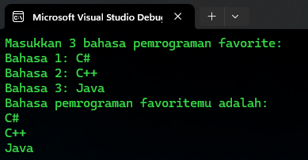
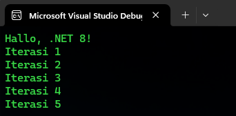
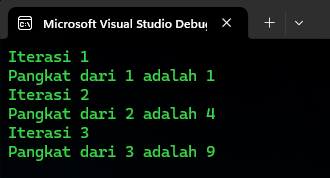

### Memulai dengan .NET (Menggunakan .NET 8)

#### 1. Mengatur Lingkungan Pengembangan (Visual Studio)

**Langkah-langkah Mengatur Visual Studio untuk .NET 8:**

1. **Unduh dan Instal Visual Studio:**
   - Kunjungi [situs resmi Visual Studio](https://visualstudio.microsoft.com/downloads/).
   - Pilih edisi Visual Studio yang sesuai (Community, Professional, atau Enterprise).
   - Klik **Free download** untuk memulai unduhan.
   - Setelah unduhan selesai, jalankan installer dan ikuti petunjuk di layar.

2. **Pilih Workloads untuk .NET 8:**
   - Saat menjalankan installer, Anda akan diminta untuk memilih workloads.
   - Untuk pengembangan .NET 8, pilih:
     - **ASP.NET and web development:** Untuk aplikasi web.
     - **Desktop development with .NET:** Untuk aplikasi desktop.
     - **.NET Core cross-platform development:** Untuk aplikasi lintas platform.
   - Pastikan versi .NET 8 sudah tersedia dan dipilih.

3. **Mulai Visual Studio:**
   - Setelah instalasi selesai, buka Visual Studio.
   - Pilih **Create a new project** untuk memulai proyek baru.

4. **Konfigurasi Awal:**
   - Pilih template proyek, seperti **Console App (.NET 8)** untuk aplikasi konsol.
   - Beri nama proyek dan pilih lokasi penyimpanan.
   - Klik **Create** untuk memulai proyek baru.

5. **Pengaturan Tools dan Extensions:**
   - Buka **Extensions** di menu bar untuk menambahkan plugin atau alat tambahan yang diperlukan.
   - Contoh ekstensi yang bermanfaat adalah **Resharper** untuk meningkatkan produktivitas coding.

**Contoh:**
Saat Anda membuat aplikasi pertama kali, Anda akan melihat file `Program.cs` di dalam proyek Anda. Ini adalah titik awal aplikasi konsol.

```csharp
using System;

namespace MyFirstApp
{
    class Program
    {
        static void Main(string[] args)
        {
            Console.WriteLine("Hallo, .NET 8!");

            // Contoh sederhana menggunakan pola interpolasi string di C#
            string name = "Developer";
            Console.WriteLine($"Selamat datang di .NET 8, {name}!");
        }
    }
}
```


#### 2. Mengatur Lingkungan Pengembangan (Visual Studio Code)

**Langkah-langkah Mengatur Visual Studio Code untuk .NET 8:**

1. **Unduh dan Instal Visual Studio Code:**
   - Kunjungi [situs resmi Visual Studio Code](https://code.visualstudio.com/).
   - Klik **Download** dan pilih versi yang sesuai dengan sistem operasi Anda.
   - Setelah unduhan selesai, jalankan installer dan ikuti petunjuk di layar.

2. **Menginstal Ekstensi C# untuk .NET 8:**
   - Buka Visual Studio Code.
   - Klik ikon **Extensions** di sidebar kiri.
   - Cari "C#" di kotak pencarian dan pilih ekstensi yang dibuat oleh Microsoft.
   - Klik **Install** untuk menginstal ekstensi.

3. **Memulai Proyek Baru Menggunakan .NET 8:**
   - Buka terminal di VS Code (`Ctrl + `).
   - Buat proyek baru dengan mengetik perintah `dotnet new console -n MyFirstApp --framework net8.0`.
   - Buka folder proyek yang baru dibuat dengan memilih **File > Open Folder** di VS Code.

4. **Menulis dan Menjalankan Kode:**
   - Buka file `Program.cs` yang ada di folder proyek Anda.
   - Tulis kode yang diperlukan dan simpan file.
   - Untuk menjalankan aplikasi, buka terminal dan ketik `dotnet run`.

**Contoh:**
Berikut adalah contoh kode di `Program.cs` yang mencetak pesan ke konsol:

```csharp
using System;

namespace MyFirstApp
{
    class Program
    {
        static void Main(string[] args)
        {
            Console.WriteLine("Hello, .NET 8!");

            // Contoh menggunakan DateTime di .NET 8
            DateTime currentTime = DateTime.Now;
            Console.WriteLine($"Waktu sekarang: {currentTime}");
        }
    }
}
```


#### 3. Membuat Aplikasi Console .NET Pertama Anda Menggunakan C#

**Langkah-langkah Membuat Aplikasi Console dengan .NET 8:**

1. **Buka Visual Studio:**
   - Pilih **Create a new project**.
   - Pilih template **Console App (.NET 8)** dan klik **Next**.

2. **Konfigurasi Proyek:**
   - Beri nama proyek Anda, misalnya `MyFirstConsoleApp`.
   - Pilih lokasi untuk menyimpan proyek.
   - Klik **Create** untuk membuat proyek baru.

3. **Menulis Kode di .NET 8:**
   - Setelah proyek dibuat, Anda akan melihat file `Program.cs`.
   - Di dalam file `Program.cs`, tuliskan kode berikut untuk mencetak pesan ke konsol:

   ```csharp
   using System;

   namespace MyFirstConsoleApp
   {
       class Program
       {
           static void Main(string[] args)
           {
               Console.WriteLine("Selamat datang di .NET 8!");

               // Contoh menggunakan pengkondisian sederhana di C#
               Console.Write("Masukkan umur anda: ");
               int age = int.Parse(Console.ReadLine());

               if (age >= 18)
               {
                   Console.WriteLine("Anda sudah dewasa.");
               }
               else
               {
                   Console.WriteLine("Anda belum dewasa.");
               }
           }
       }
   }
   ```
   

4. **Menjalankan Aplikasi:**
   - Untuk menjalankan aplikasi, klik tombol **Run** di toolbar atau tekan `Ctrl + F5`.
   - Anda akan melihat output "Welcome to .NET 8!" di konsol.

5. **Menambahkan Fitur Tambahan:**
   - Anda bisa menambahkan fitur lain, seperti penggunaan array:

   ```csharp
   Console.WriteLine("Masukkan 3 bahasa pemrograman favorite:");
   string[] languages = new string[3];

   for (int i = 0; i < languages.Length; i++)
   {
       Console.Write($"Bahasa {i + 1}: ");
       languages[i] = Console.ReadLine();
   }

   Console.WriteLine("Bahasa pemrograman favoritemu adalah:");
   foreach (string language in languages)
   {
       Console.WriteLine(language);
   }
   ```
   

   - Jalankan kembali aplikasi untuk melihat hasilnya.

#### 4. Memahami Struktur Proyek (Program.cs, .csproj, Solution, dll)

**Komponen Utama Proyek .NET 8/9:**

1. **Program.cs:**
   - Ini adalah file utama yang berisi titik masuk aplikasi. Di sini, fungsi `Main` dijalankan pertama kali saat aplikasi dimulai.

   ```csharp
   using System;

   namespace MyFirstApp
   {
       class Program
       {
           static void Main(string[] args)
           {
               Console.WriteLine("Hallo, .NET 8!");

               // Contoh menggunakan loop sederhana di C#
               for (int i = 1; i <= 5; i++)
               {
                   Console.WriteLine($"Iterasi {i}");
               }
           }
       }
   }
   ```
   

2. **.csproj (C# Project File):**
   - File `.csproj` adalah file XML yang berisi konfigurasi proyek, seperti referensi pustaka, target framework, dan informasi lainnya yang diperlukan untuk membangun proyek.

   ```xml
   <Project Sdk="Microsoft.NET.Sdk">
     <PropertyGroup>
       <OutputType>Exe</OutputType>
       <TargetFramework>net8.0</TargetFramework>
     </PropertyGroup>
   </Project>
   ```

   - `.csproj` juga mengelola paket NuGet yang digunakan dalam proyek, yang bisa ditambahkan menggunakan `dotnet add package`.

3. **Solution File (.sln):**
   - File `.sln` adalah file solusi yang dapat menampung beberapa proyek. Ini membantu dalam mengelola proyek yang saling terkait dalam satu lingkungan pengembangan.

4. **Dependencies:**
   - Bagian ini mengelola pustaka dan paket NuGet yang digunakan dalam proyek. Dependencies ini didefinisikan di file `.csproj`.

5. **Properties:**
   - Folder ini biasanya berisi file `launchSettings.json`, yang menyimpan konfigurasi untuk menjalankan dan debugging aplikasi.

**Contoh:**
Jika Anda memiliki proyek dengan beberapa file `.cs`, semua file tersebut akan digabungkan menjadi satu program ketika dibangun, dan aturan penggabungan ini didefinisikan di file `.csproj`.

```xml
<Project Sdk="Microsoft.NET.Sdk">

  <PropertyGroup>
    <OutputType>Exe</OutputType>
    <TargetFramework>net8.0</TargetFramework>
  </PropertyGroup>

  <ItemGroup>
    <Compile Include="Program.cs" />
    <Compile Include="AnotherFile.cs" />
  </ItemGroup>

</Project>
```

#### 5. Menjalankan dan Debugging Aplikasi .NET Menggunakan Visual Studio

**Langkah-langkah untuk Menjalankan dan Debugging di .NET 8:**

1. **Menjalankan Aplikasi:**
   - Klik tombol **Run** di toolbar atau tekan `Ctrl + F5`.
   - Aplikasi akan berjalan dan output akan muncul di konsol.

2. **Menambahkan Breakpoint:**
   - Klik di

 sebelah kiri nomor baris di `Program.cs` untuk menambahkan breakpoint. Ini akan menghentikan eksekusi program di titik tertentu, memungkinkan Anda memeriksa nilai variabel dan alur program.

3. **Memulai Debugging:**
   - Klik tombol **Start Debugging** atau tekan `F5`.
   - Program akan berhenti di breakpoint yang telah Anda set, dan Anda bisa melihat nilai variabel di jendela **Locals**.

4. **Langkah-langkah Debugging:**
   - Gunakan **Step Over (F10)** untuk melangkah ke baris berikutnya tanpa masuk ke dalam fungsi.
   - Gunakan **Step Into (F11)** untuk masuk ke dalam fungsi dan debug setiap langkah.
   - Gunakan **Step Out (Shift + F11)** untuk keluar dari fungsi dan melanjutkan debugging di fungsi pemanggil.

**Contoh:**
Jika Anda men-debug aplikasi berikut, Anda bisa menghentikan eksekusi di `Console.WriteLine` kedua dan memeriksa nilai `i`:

```csharp
using System;

namespace MyFirstApp
{
    class Program
    {
        static void Main(string[] args)
        {
            for (int i = 1; i <= 3; i++)
            {
                Console.WriteLine($"Iterasi {i}");
                Console.WriteLine($"Pangkat dari {i} adalah {i * i}");
            }
        }
    }
}
```


#### 6. Contoh Penggunaan dotnet CLI dalam Membuat Aplikasi Sederhana Menggunakan C#

**Langkah-langkah Menggunakan dotnet CLI dengan .NET 8:**

1. **Membuat Proyek Baru Menggunakan dotnet CLI:**
   - Buka terminal atau command prompt.
   - Ketik `dotnet new console -n MyCLIApp --framework net8.0` untuk membuat proyek baru.
   - Masuk ke direktori proyek dengan `cd MyCLIApp`.

2. **Menulis dan Menjalankan Kode:**
   - Buka file `Program.cs` dan tambahkan kode berikut:

   ```csharp
   using System;

   namespace MyCLIApp
   {
       class Program
       {
           static void Main(string[] args)
           {
               Console.WriteLine("Hallo, Dunia CLI!");

               // Contoh sederhana menggunakan array dan loop di C#
               string[] fruits = { "Apel", "Pisang", "Nanas","Jeruk" };
               foreach (string fruit in fruits)
               {
                   Console.WriteLine(fruit);
               }
           }
       }
   }
   ```
   

   - Simpan file dan kembali ke terminal.

3. **Membangun dan Menjalankan Proyek:**
   - Jalankan perintah `dotnet build` untuk membangun proyek.
   - Setelah proses build selesai, jalankan aplikasi dengan perintah `dotnet run`.

4. **Menambahkan Paket NuGet:**
   - Anda bisa menambahkan paket pihak ketiga ke proyek Anda menggunakan `dotnet add package`. Misalnya, untuk menambahkan `Newtonsoft.Json`, gunakan perintah berikut:

   ```bash
   dotnet add package Newtonsoft.Json
   ```

5. **Menggunakan Paket NuGet:**
   - Setelah menambahkan paket, Anda bisa menggunakannya dalam kode:

   ```csharp
   using Newtonsoft.Json;
   using System;

   namespace MyCLIApp
   {
       class Program
       {
           static void Main(string[] args)
           {
               var person = new { Name = "Rara Anjani", Age = 30 };
               string json = JsonConvert.SerializeObject(person);
               Console.WriteLine($"JSON: {json}");
           }
       }
   }
   ```
   

6. **Mempublikasikan Aplikasi:**
   - Untuk mendistribusikan aplikasi Anda, Anda bisa mempublikasikannya menggunakan perintah berikut:

   ```bash
   dotnet publish -c Release -r win-x64
   ```

   - Ini akan menghasilkan file executable yang dapat dijalankan di sistem operasi target.
