### Pengenalan C#

#### Apa itu Bahasa Pemrograman C#?
C# (dibaca "C-sharp") adalah bahasa pemrograman yang dikembangkan oleh Microsoft sebagai bagian dari platform .NET. C# dirancang sebagai bahasa pemrograman yang sederhana, modern, dan berorientasi objek. Ini berarti bahwa C# memungkinkan pengembang untuk bekerja dengan konsep-konsep seperti kelas, objek, dan pewarisan, yang membuat pengembangan perangkat lunak lebih mudah dan terstruktur.

**Keunggulan C#:**
1. **Berorientasi Objek:** Memungkinkan pengembangan perangkat lunak yang modular dan dapat diperbarui.
2. **Keamanan Tipe Data:** C# memiliki sistem tipe data yang kuat yang membantu menghindari kesalahan pemrograman.
3. **Manajemen Memori Otomatis:** Dengan garbage collection, pengelolaan memori dilakukan secara otomatis.
4. **Cross-Platform:** Dengan .NET Core, aplikasi C# bisa berjalan di berbagai platform seperti Windows, macOS, dan Linux.

#### Sejarah Bahasa Pemrograman C#
C# pertama kali diperkenalkan pada tahun 2000 oleh Microsoft sebagai bagian dari .NET Framework. Bahasa ini dirancang oleh Anders Hejlsberg, yang juga pernah mengembangkan bahasa Turbo Pascal dan Delphi. C# telah mengalami banyak perkembangan sejak versi pertama, dengan tambahan fitur-fitur baru di setiap versi untuk mendukung pengembangan perangkat lunak yang lebih canggih dan efisien.

**Beberapa Sejarah C#:**
- **C# 1.0 (2002):** Versi pertama yang mendukung konsep dasar OOP seperti kelas, objek, dan pewarisan.
- **C# 2.0 (2005):** Memperkenalkan fitur seperti generics, iterators, dan nullable types.
- **C# 3.0 (2007):** Memperkenalkan LINQ (Language Integrated Query) untuk memudahkan manipulasi data.
- **C# 5.0 (2012):** Memperkenalkan async/await untuk pemrograman asinkron.
- **C# 9.0 (2020):** Memperkenalkan fitur seperti records, init-only properties, dan banyak lagi.

#### Menulis Program C# Pertama Anda
Untuk memulai dengan C#, kita akan menulis program sederhana yang akan mencetak "Halo, Dunia!" ke layar. Ini adalah tradisi dalam mempelajari bahasa pemrograman baru.

**Langkah-langkah:**

1. **Buka Visual Studio atau Visual Studio Code.**
2. **Buat proyek baru dengan memilih "Console App".**
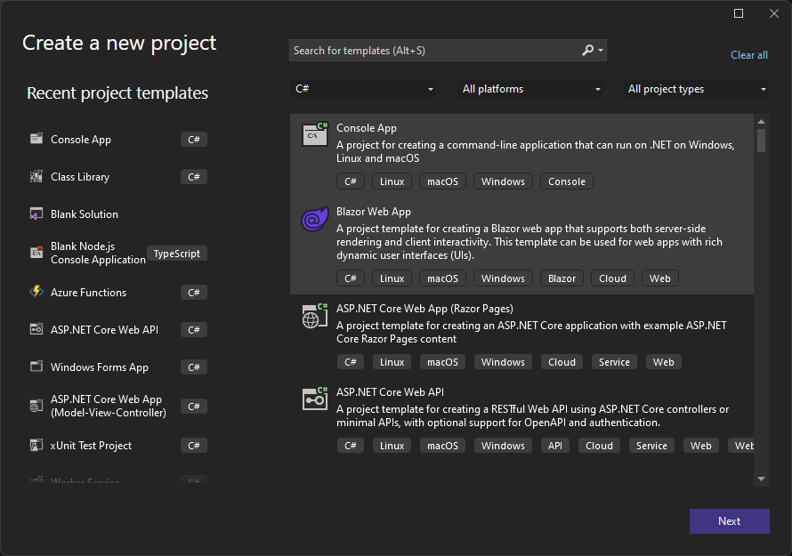
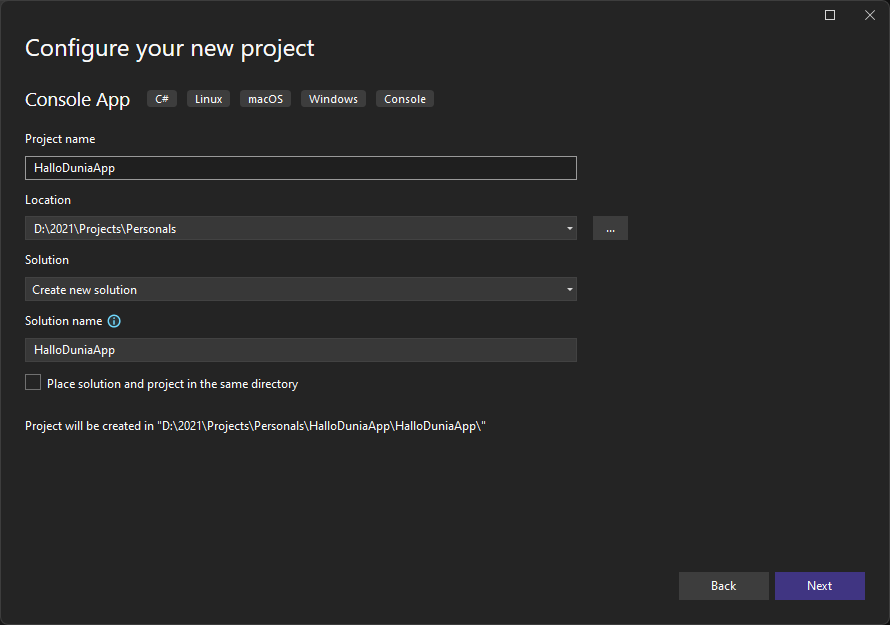

3. **Tulis kode berikut di file `Program.cs`:**

```csharp
using System;

namespace HaloDuniaApp
{
    class Program
    {
        static void Main(string[] args)
        {
            // Menampilkan teks "Halo, Dunia!" di konsol
            Console.WriteLine("Halo, Dunia!");
            Console.ReadLine();  // Menunggu input dari pengguna untuk menutup aplikasi
        }
    }
}
```

**Penjelasan Kode:**
- `namespace HaloDuniaApp`: Ini adalah ruang lingkup tempat kode Anda dikelompokkan.
- `class Program`: Kelas utama dari program Anda. Di dalamnya terdapat metode `Main`.
- `static void Main(string[] args)`: Titik awal dari eksekusi program. Metode ini akan dijalankan pertama kali.
- `Console.WriteLine("Halo, Dunia!");`: Perintah untuk menampilkan teks "Halo, Dunia!" ke layar.
- `Console.ReadLine();`: Menunggu input dari pengguna sehingga konsol tidak langsung tertutup setelah menampilkan pesan.

**Contoh Program Lain:**

1. **Menghitung Penjumlahan Dua Angka**
```csharp
using System;

namespace PenjumlahanApp
{
    class Program
    {
        static void Main(string[] args)
        {
            Console.Write("Masukkan angka pertama: ");
            int angka1 = int.Parse(Console.ReadLine());

            Console.Write("Masukkan angka kedua: ");
            int angka2 = int.Parse(Console.ReadLine());

            int hasil = angka1 + angka2;
            Console.WriteLine($"Hasil penjumlahan: {hasil}");
            Console.ReadLine();
        }
    }
}
```
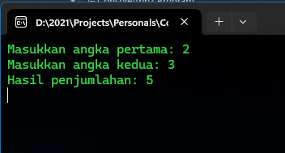

2. **Menghitung Luas Lingkaran**
```csharp
using System;

namespace LuasLingkaranApp
{
    class Program
    {
        static void Main(string[] args)
        {
            Console.Write("Masukkan jari-jari lingkaran: ");
            double jariJari = double.Parse(Console.ReadLine());

            double luas = Math.PI * jariJari * jariJari;
            Console.WriteLine($"Luas lingkaran: {luas}");
            Console.ReadLine();
        }
    }
}
```
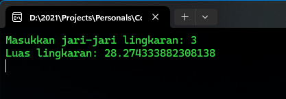

3. **Menampilkan Deret Bilangan Ganjil**
```csharp
using System;

namespace DeretBilanganGanjilApp
{
    class Program
    {
        static void Main(string[] args)
        {
            Console.WriteLine("Deret bilangan ganjil dari 1 hingga 10:");
            for (int i = 1; i <= 10; i += 2)
            {
                Console.WriteLine(i);
            }
            Console.ReadLine();
        }
    }
}
```
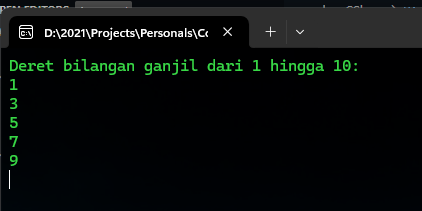

#### Pengenalan Variabel dan Tipe Data
Variabel adalah tempat penyimpanan data sementara yang digunakan dalam program. Setiap variabel harus memiliki tipe data yang sesuai dengan nilai yang disimpannya.

**Tipe Data Utama dalam C#:**
1. **int**: Untuk menyimpan bilangan bulat, seperti `int umur = 25;`.
2. **double**: Untuk menyimpan bilangan desimal, seperti `double suhu = 36.6;`.
3. **char**: Untuk menyimpan satu karakter, seperti `char huruf = 'A';`.
4. **string**: Untuk menyimpan teks atau rangkaian karakter, seperti `string nama = "Budi";`.
5. **bool**: Untuk menyimpan nilai `true` atau `false`, seperti `bool isValid = true;`.

**Contoh Program Menggunakan Variabel dan Tipe Data:**

1. **Menampilkan Nilai Variabel**
```csharp
using System;

namespace VariabelApp
{
    class Program
    {
        static void Main(string[] args)
        {
            int umur = 25;
            string nama = "Budi";
            double suhu = 36.6;
            bool isValid = true;

            Console.WriteLine($"Nama: {nama}, Umur: {umur}, Suhu: {suhu}, Valid: {isValid}");
            Console.ReadLine();
        }
    }
}
```
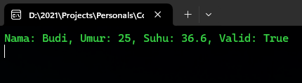

2. **Operasi Matematika Dasar**
```csharp
using System;

namespace OperasiMatematikaApp
{
    class Program
    {
        static void Main(string[] args)
        {
            int a = 5;
            int b = 3;

            int penjumlahan = a + b;
            int pengurangan = a - b;
            int perkalian = a * b;
            double pembagian = (double)a / b;

            Console.WriteLine($"Penjumlahan: {penjumlahan}, Pengurangan: {pengurangan}, Perkalian: {perkalian}, Pembagian: {pembagian}");
            Console.ReadLine();
        }
    }
}
```
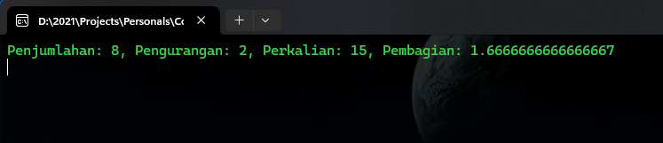

3. **Mengubah Nilai Variabel**
```csharp
using System;

namespace UbahNilaiVariabelApp
{
    class Program
    {
        static void Main(string[] args)
        {
            int x = 10;
            Console.WriteLine($"Nilai awal x: {x}");

            x = 20;
            Console.WriteLine($"Nilai baru x: {x}");
            Console.ReadLine();
        }
    }
}
```
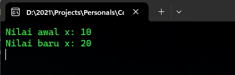

4. **Penggunaan Variabel Boolean**
```csharp
using System;

namespace BooleanApp
{
    class Program
    {
        static void Main(string[] args)
        {
            bool isEven = 4 % 2 == 0;

            if (isEven)
            {
                Console.WriteLine("Angka tersebut adalah genap.");
            }
            else
            {
                Console.WriteLine("Angka tersebut adalah ganjil.");
            }
            Console.ReadLine();
        }
    }
}
```
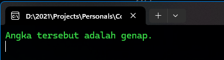

5. **Kalkulator Sederhana dengan Input Pengguna**
```csharp
using System;

namespace KalkulatorApp
{
    class Program
    {
        static void Main(string[] args)
        {
            Console.Write("Masukkan angka pertama: ");
            int num1 = int.Parse(Console.ReadLine());

            Console.Write("Masukkan angka kedua: ");
            int num2 = int.Parse(Console.ReadLine());

            int hasil = num1 + num2;
            Console.WriteLine($"Hasil penjumlahan: {hasil}");
            Console.ReadLine();
        }
    }
}
```
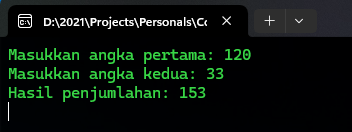

#### Operasi Input/Output Dasar
Operasi input/output (I/O) adalah cara kita berinteraksi dengan pengguna atau dengan data eksternal. Di C#, `Console.ReadLine()` atau `Console.ReadKey()` digunakan untuk mengambil input dari pengguna, dan `Console.WriteLine()` digunakan untuk menampilkan output ke layar.

**Contoh Program Input/Output Dasar:**

1. **Mengambil dan Menampilkan Nama Pengguna**
```csharp
using System;

namespace InputNamaApp
{
    class Program
    {
        static void Main(string[] args)
        {
            Console.Write("Masukkan nama Anda: ");
            string nama = Console.ReadLine();
            Console.WriteLine($"Halo, {nama}!");
            Console.ReadLine();
        }
    }
}
```
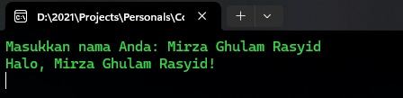

1. **Mengambil Dua Angka dan Menampilkan Hasil Penjumlahan**
```csharp
using System;

namespace PenjumlahanInputApp
{
    class Program
    {
        static void Main(string[] args)
        {
            Console.Write("Masukkan angka pertama: ");
            int angka1 = int.Parse(Console.ReadLine());

            Console.Write("Masukkan angka kedua: ");
            int angka2 = int.Parse(Console.ReadLine());

            int hasil = angka1 + angka2;
            Console.WriteLine($"Hasil penjumlahan: {hasil}");
            Console.ReadLine();
        }
    }
}
```
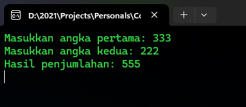

3. **Mengambil Input Umur dan Menampilkan Kategori Umur**
```csharp
using System;

namespace KategoriUmurApp
{
    class Program
    {
        static void Main(string[] args)
        {
            Console.Write("Masukkan umur Anda: ");
            int umur = int.Parse(Console.ReadLine());

            if (umur < 18)
            {
                Console.WriteLine("Anda termasuk kategori remaja.");
            }
            else
            {
                Console.WriteLine("Anda termasuk kategori dewasa.");
            }
            Console.ReadLine();
        }
    }
}
```
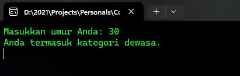

4. **Membuat Program Kalkulator Sederhana**
```csharp
using System;

namespace KalkulatorSederhanaApp
{
    class Program
    {
        static void Main(string[] args)
        {
            Console.Write("Masukkan angka pertama: ");
            int num1 = int.Parse(Console.ReadLine());

            Console.Write("Masukkan angka kedua: ");
            int num2 = int.Parse(Console.ReadLine());

            Console.WriteLine("Pilih operasi (+, -, *, /): ");
            char operasi = Console.ReadKey().KeyChar;
            Console.WriteLine();

            int hasil = 0;
            switch (operasi)
            {
                case '+':
                    hasil = num1 + num2;
                    break;
                case '-':
                    hasil = num1 - num2;
                    break;
                case '*':
                    hasil = num1 * num2;
                    break;
                case '/':
                    hasil = num1 / num2;
                    break;
                default:
                    Console.WriteLine("Operasi tidak valid.");
                    return;
            }

            Console.WriteLine($"Hasil: {hasil}");
            Console.ReadLine();
        }
    }
}
```
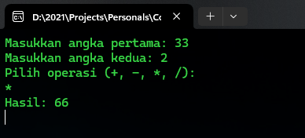


#### Perbedaan Console.ReadLine() dan Console.ReadKey()

**Console.ReadLine()** dan **Console.ReadKey()** adalah dua metode yang digunakan untuk menerima input dari pengguna di konsol, tetapi keduanya memiliki perbedaan dalam cara mereka bekerja dan jenis input yang mereka ambil.

**1. Console.ReadLine()**
- **Fungsi Utama:** Console.ReadLine() digunakan untuk membaca seluruh baris teks yang diinputkan oleh pengguna hingga tombol Enter ditekan. 
- **Tipe Data yang Dikembalikan:** Metode ini mengembalikan input pengguna dalam bentuk string.
- **Cara Penggunaan:** Pengguna dapat mengetik teks sebanyak yang mereka mau, termasuk spasi, dan input tersebut akan dikembalikan setelah menekan Enter.

**Contoh Penggunaan:**

```csharp
using System;

namespace ReadLineExample
{
    class Program
    {
        static void Main(string[] args)
        {
            Console.Write("Masukkan nama Anda: ");
            string nama = Console.ReadLine();
            Console.WriteLine($"Halo, {nama}!");
        }
    }
}
```
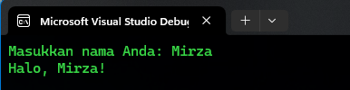

**Penjelasan:**
- Ketika pengguna menjalankan program ini, mereka akan diminta untuk memasukkan nama mereka. Setelah menekan Enter, nama yang dimasukkan akan disimpan dalam variabel `nama` dan ditampilkan kembali di konsol.

**2. Console.ReadKey()**
- **Fungsi Utama:** Console.ReadKey() digunakan untuk membaca satu karakter yang diinputkan oleh pengguna tanpa harus menekan tombol Enter.
- **Tipe Data yang Dikembalikan:** Metode ini mengembalikan objek bertipe `ConsoleKeyInfo`, yang berisi informasi tentang tombol yang ditekan, termasuk karakter, kunci fisik, dan apakah tombol modifier seperti Shift atau Ctrl ditekan.
- **Cara Penggunaan:** Ketika metode ini dipanggil, program akan berhenti sejenak dan menunggu pengguna untuk menekan sembarang tombol. Setelah tombol ditekan, input tersebut segera dikembalikan tanpa menunggu Enter.

**Contoh Penggunaan:**

```csharp
using System;

namespace ReadKeyExample
{
    class Program
    {
        static void Main(string[] args)
        {
            Console.Write("Tekan sembarang tombol: ");
            ConsoleKeyInfo keyInfo = Console.ReadKey();
            Console.WriteLine($"\nAnda menekan tombol: {keyInfo.KeyChar}");
        }
    }
}
```
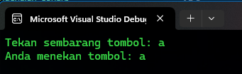

**Penjelasan:**
- Program ini akan menunggu hingga pengguna menekan satu tombol. Karakter yang ditekan akan ditampilkan setelahnya.

 **Perbedaan Utama:**

- **Input yang Diambil:**
  - `Console.ReadLine()` mengambil seluruh baris input hingga Enter ditekan.
  - `Console.ReadKey()` hanya mengambil satu karakter input, segera setelah tombol ditekan, tanpa perlu menunggu Enter.
  
- **Penggunaan dalam Program:**
  - `Console.ReadLine()` cocok digunakan saat Anda membutuhkan seluruh teks atau data dari pengguna, seperti nama, alamat, atau kalimat.
  - `Console.ReadKey()` lebih cocok untuk interaksi yang memerlukan respon cepat dari pengguna, seperti saat menunggu pengguna menekan tombol untuk melanjutkan atau saat membuat menu berbasis tombol.
