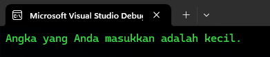

### Statement Kondisi dan Pengulangan di C#

Dalam bahasa pemrograman C#, statement kondisi dan pengulangan adalah dua konsep penting yang memungkinkan kita untuk mengontrol alur eksekusi program berdasarkan kondisi tertentu dan untuk mengulangi eksekusi suatu blok kode.

#### **Struktur Kontrol Kondisi (if, switch)**

Struktur kontrol kondisi digunakan untuk membuat keputusan dalam program. Program akan memeriksa kondisi tertentu, dan berdasarkan hasilnya, akan mengeksekusi satu blok kode dan melewati blok lainnya.

##### **1. If Statement**
`if` statement digunakan untuk mengeksekusi sekelompok pernyataan hanya jika kondisi yang diberikan bernilai `true` (benar).

**Contoh 1: If sederhana**
```csharp
using System;

namespace IfStatementExample
{
    class Program
    {
        static void Main(string[] args)
        {
            int nilai = 75;

            // Mengecek apakah nilai lebih besar atau sama dengan 60
            if (nilai >= 60)
            {
                Console.WriteLine("Anda lulus!"); // Ini akan dieksekusi jika kondisi true
            }
        }
    }
}
```


**Penjelasan:** Pada contoh ini, kita memiliki variabel `nilai` yang diatur ke 75. Program akan memeriksa apakah `nilai` lebih besar atau sama dengan 60. Jika benar (`true`), maka program akan mencetak "Anda lulus!". Jika `nilai` kurang dari 60, tidak ada yang akan dicetak.


**Contoh 2: If-else**
```csharp
using System;

namespace IfElseExample
{
    class Program
    {
        static void Main(string[] args)
        {
            int nilai = 50;

            // Mengecek apakah nilai lebih besar atau sama dengan 60
            if (nilai >= 60)
            {
                Console.WriteLine("Anda lulus!");
            }
            else
            {
                Console.WriteLine("Anda tidak lulus."); // Ini akan dieksekusi jika kondisi false
            }
        }
    }
}
```

**Penjelasan:** Di sini, kita menambahkan bagian `else`. Jika kondisi `nilai >= 60` salah (`false`), maka program akan mencetak "Anda tidak lulus.".


**Contoh 3: If-else if-else**
```csharp
using System;

namespace IfElseIfElseExample
{
    class Program
    {
        static void Main(string[] args)
        {
            int nilai = 85;

            // Mengecek nilai untuk memberikan grade
            if (nilai >= 90)
            {
                Console.WriteLine("Grade A");
            }
            else if (nilai >= 80)
            {
                Console.WriteLine("Grade B");
            }
            else if (nilai >= 70)
            {
                Console.WriteLine("Grade C");
            }
            else
            {
                Console.WriteLine("Grade D");
            }
        }
    }
}
```


**Penjelasan:** Contoh ini menggunakan beberapa `else if` untuk memeriksa berbagai kondisi. Program akan memeriksa setiap kondisi dari atas ke bawah dan mengeksekusi blok kode pertama yang kondisinya benar. Jika `nilai` antara 80 dan 89, maka akan mencetak "Grade B".

**Contoh 4: Nested if**
```csharp
using System;

namespace NestedIfExample
{
    class Program
    {
        static void Main(string[] args)
        {
            int umur = 20;
            bool memilikiSIM = true;

            // Mengecek umur dan status kepemilikan SIM
            if (umur >= 18)
            {
                if (memilikiSIM)
                {
                    Console.WriteLine("Anda boleh mengemudi.");
                }
                else
                {
                    Console.WriteLine("Anda tidak boleh mengemudi tanpa SIM.");
                }
            }
            else
            {
                Console.WriteLine("Anda terlalu muda untuk mengemudi.");
            }
        }
    }
}
```


**Penjelasan:** Ini adalah contoh `nested if`, yaitu if statement di dalam if statement lainnya. Program memeriksa apakah umur pengguna lebih dari 18 tahun, dan jika benar, memeriksa apakah pengguna memiliki SIM. Hanya jika kedua kondisi ini terpenuhi, pengguna diizinkan untuk mengemudi.

**Contoh 5: Penggunaan kondisi logis dalam if**
```csharp
using System;

namespace LogicalIfExample
{
    class Program
    {
        static void Main(string[] args)
        {
            int nilai = 85;
            bool tugasSelesai = true;

            // Mengecek apakah nilai cukup dan tugas selesai
            if (nilai >= 80 && tugasSelesai)
            {
                Console.WriteLine("Anda mendapatkan nilai baik dan tugas selesai.");
            }
            else
            {
                Console.WriteLine("Anda perlu memperbaiki nilai atau menyelesaikan tugas.");
            }
        }
    }
}
```


**Penjelasan:** Pada contoh ini, kita menggunakan operator logis `&&` untuk memastikan bahwa kedua kondisi (`nilai >= 80` dan `tugasSelesai`) harus benar (`true`) agar pesan "Anda mendapatkan nilai baik dan tugas selesai." dicetak. Jika salah satu atau kedua kondisi salah, program akan mengeksekusi blok `else`.

##### **2. Switch Statement**
`switch` statement digunakan untuk memilih salah satu dari beberapa blok kode yang akan dijalankan berdasarkan nilai dari sebuah variabel.

**Contoh 1: Switch sederhana**
```csharp
using System;

namespace SwitchExample
{
    class Program
    {
        static void Main(string[] args)
        {
            int hari = 3;

            switch (hari)
            {
                case 1:
                    Console.WriteLine("Hari ini adalah Senin.");
                    break;
                case 2:
                    Console.WriteLine("Hari ini adalah Selasa.");
                    break;
                case 3:
                    Console.WriteLine("Hari ini adalah Rabu.");
                    break;
                case 4:
                    Console.WriteLine("Hari ini adalah Kamis.");
                    break;
                case 5:
                    Console.WriteLine("Hari ini adalah Jumat.");
                    break;
                default:
                    Console.WriteLine("Hari yang Anda masukkan tidak valid.");
                    break;
            }
        }
    }
}
```


**Penjelasan:** Program ini menggunakan `switch` untuk memeriksa nilai `hari`. Jika `hari` adalah 3, maka program akan mencetak "Hari ini adalah Rabu.". Jika tidak ada case yang sesuai dengan nilai `hari`, program akan menjalankan blok `default`, yang mencetak "Hari yang Anda masukkan tidak valid."

**Contoh 2: Switch dengan string**
```csharp
using System;

namespace SwitchStringExample
{
    class Program
    {
        static void Main(string[] args)
        {
            string warna = "merah";

            switch (warna)
            {
                case "merah":
                    Console.WriteLine("Warna favorit Anda adalah merah.");
                    break;
                case "biru":
                    Console.WriteLine("Warna favorit Anda adalah biru.");
                    break;
                case "hijau":
                    Console.WriteLine("Warna favorit Anda adalah hijau.");
                    break;
                default:
                    Console.WriteLine("Warna tidak dikenali.");
                    break;
            }
        }
    }
}
```


**Penjelasan:** Dalam contoh ini, kita menggunakan `switch` untuk memeriksa string `warna`. Berdasarkan nilai `warna`, program akan mencetak pesan yang sesuai. Jika `warna` bukan "merah", "biru", atau "hijau", program akan mencetak "Warna tidak dikenali."

**Contoh 3: Switch dengan banyak pernyataan pada satu case**
```csharp
using System;

namespace MultipleCaseExample
{
    class Program
    {
        static void Main(string[] args)
        {
            int angka = 2;

            switch (angka)
            {
                case 1:
                case 2:
                case 3:
                    Console.WriteLine("Angka yang Anda masukkan adalah kecil.");
                    break;
                case 4:
                case 5:
                case 6:
                    Console.WriteLine("Angka yang Anda masukkan adalah sedang.");
                    break;
                default:
                    Console.WriteLine("Angka yang Anda masukkan adalah besar.");
                    break;
            }
        }
    }
}
```


**Penjelasan:** Dalam `switch` ini, beberapa `case` dikelompokkan bersama untuk mengeksekusi kode yang sama. Jika `angka` adalah 1, 2, atau 3, maka program akan mencetak "Angka yang Anda masukkan adalah kecil."

**Contoh 4: Switch tanpa default**
```csharp
using System;

namespace SwitchNoDefaultExample
{
    class Program
    {
        static void Main(string[] args)
        {
            int bulan = 8;

            switch (bulan)
            {
                case 12:
                case 1:
                case 2:
                    Console.WriteLine("Ini adalah musim dingin.");
                    break;
                case 3:
                case 4:
                case 5:
                    Console.WriteLine("Ini adalah musim semi.");
                    break;
                case 6:
                case 7:
                case 8:
                    Console.WriteLine("Ini adalah musim panas.");
                    break;
                case 9:
                case 10:
                case 11:
                    Console.WriteLine("Ini adalah musim gugur.");
                    break;
            }
        }
    }
}
```


**Penjelasan:** Dalam contoh ini, `switch` tidak memiliki `default`. Jika `bulan` memiliki nilai di luar yang dicakup oleh case, tidak ada yang akan dicetak.

**Contoh 5: Switch dengan enum**
```csharp
using System;

namespace EnumSwitchExample
{
    class Program
    {
        enum Hari { Senin

, Selasa, Rabu, Kamis, Jumat, Sabtu, Minggu }

        static void Main(string[] args)
        {
            Hari hariIni = Hari.Rabu;

            switch (hariIni)
            {
                case Hari.Senin:
                    Console.WriteLine("Awal minggu.");
                    break;
                case Hari.Rabu:
                    Console.WriteLine("Tengah minggu.");
                    break;
                case Hari.Jumat:
                    Console.WriteLine("Akhir minggu.");
                    break;
                default:
                    Console.WriteLine("Hari biasa.");
                    break;
            }
        }
    }
}
```


**Penjelasan:** Program ini menggunakan `enum` untuk merepresentasikan hari-hari dalam seminggu. `switch` digunakan untuk memeriksa nilai dari `enum` dan menjalankan kode yang sesuai.

#### **Struktur Pengulangan (for, while, do-while, foreach)**

Struktur pengulangan memungkinkan kita untuk mengeksekusi blok kode berulang kali hingga kondisi tertentu terpenuhi.

##### **1. For Loop**
`for` loop digunakan untuk mengulangi blok kode dengan jumlah iterasi yang diketahui.

**Contoh 1: For loop sederhana**
```csharp
using System;

namespace ForLoopExample
{
    class Program
    {
        static void Main(string[] args)
        {
            for (int i = 1; i <= 5; i++)
            {
                Console.WriteLine($"Ini adalah perulangan ke-{i}.");
            }
        }
    }
}
```


**Penjelasan:** Program ini akan mencetak pesan sebanyak 5 kali. Variabel `i` dimulai dari 1 dan bertambah 1 setiap iterasi hingga mencapai 5.

**Contoh 2: For loop dengan array**
```csharp
using System;

namespace ArrayForLoopExample
{
    class Program
    {
        static void Main(string[] args)
        {
            int[] angka = { 2, 4, 6, 8, 10 };

            for (int i = 0; i < angka.Length; i++)
            {
                Console.WriteLine($"Angka: {angka[i]}");
            }
        }
    }
}
```


**Penjelasan:** Dalam contoh ini, `for` loop digunakan untuk mengulangi elemen-elemen dalam array `angka`. Program akan mencetak setiap elemen dari array.

**Contoh 3: For loop dengan kondisi kompleks**
```csharp
using System;

namespace ComplexForLoopExample
{
    class Program
    {
        static void Main(string[] args)
        {
            for (int i = 10; i >= 1; i -= 2)
            {
                Console.WriteLine($"Nilai i: {i}");
            }
        }
    }
}
```


**Penjelasan:** Pada contoh ini, `for` loop akan mengurangi nilai `i` sebesar 2 setiap iterasi, mulai dari 10 hingga 1. Program akan mencetak nilai `i` setiap kali loop berjalan.

**Contoh 4: Nested for loop**
```csharp
using System;

namespace NestedForLoopExample
{
    class Program
    {
        static void Main(string[] args)
        {
            for (int i = 1; i <= 3; i++)
            {
                for (int j = 1; j <= 2; j++)
                {
                    Console.WriteLine($"i: {i}, j: {j}");
                }
            }
        }
    }
}
```


**Penjelasan:** `Nested for loop` adalah loop di dalam loop lain. Dalam contoh ini, untuk setiap nilai `i`, `j` akan berjalan dari 1 hingga 2.

**Contoh 5: For loop dengan break**
```csharp
using System;

namespace BreakForLoopExample
{
    class Program
    {
        static void Main(string[] args)
        {
            for (int i = 1; i <= 5; i++)
            {
                if (i == 3)
                {
                    break; // Loop akan berhenti ketika i sama dengan 3
                }
                Console.WriteLine($"Perulangan ke-{i}");
            }
        }
    }
}
```


**Penjelasan:** Dalam contoh ini, loop akan berhenti secara paksa ketika `i` mencapai nilai 3 karena adanya statement `break`.

##### **2. While Loop**
`while` loop digunakan untuk mengulangi blok kode selama kondisi yang diberikan bernilai `true`.

**Contoh 1: While loop sederhana**
```csharp
using System;

namespace WhileLoopExample
{
    class Program
    {
        static void Main(string[] args)
        {
            int i = 1;

            while (i <= 5)
            {
                Console.WriteLine($"Ini adalah perulangan ke-{i}");
                i++; // Increment i setiap kali loop berjalan
            }
        }
    }
}
```


**Penjelasan:** `while` loop ini akan terus berjalan selama nilai `i` kurang dari atau sama dengan 5. Nilai `i` akan bertambah satu setiap iterasi.

**Contoh 2: While loop dengan kondisi user input**
```csharp
using System;

namespace WhileUserInputExample
{
    class Program
    {
        static void Main(string[] args)
        {
            string input = "";

            while (input != "keluar")
            {
                Console.WriteLine("Masukkan perintah ('keluar' untuk berhenti): ");
                input = Console.ReadLine();
            }
        }
    }
}
```


**Penjelasan:** Pada contoh ini, loop akan terus meminta input dari pengguna hingga pengguna mengetikkan "keluar".

**Contoh 3: While loop dengan kondisi kompleks**
```csharp
using System;

namespace ComplexWhileLoopExample
{
    class Program
    {
        static void Main(string[] args)
        {
            int i = 10;

            while (i > 0)
            {
                Console.WriteLine($"Nilai i: {i}");
                i -= 2; // Mengurangi nilai i sebesar 2 setiap iterasi
            }
        }
    }
}
```


**Penjelasan:** `while` loop ini akan berjalan selama nilai `i` lebih besar dari 0, dan mengurangi nilai `i` sebesar 2 setiap iterasi.

**Contoh 4: Nested while loop**
```csharp
using System;

namespace NestedWhileLoopExample
{
    class Program
    {
        static void Main(string[] args)
        {
            int i = 1;

            while (i <= 3)
            {
                int j = 1;

                while (j <= 2)
                {
                    Console.WriteLine($"i: {i}, j: {j}");
                    j++;
                }

                i++;
            }
        }
    }
}
```


**Penjelasan:** Ini adalah contoh nested `while` loop di mana loop dalam (`j`) berjalan di dalam loop luar (`i`).

**Contoh 5: While loop dengan break**
```csharp
using System;

namespace BreakWhileLoopExample
{
    class Program
    {
        static void Main(string[] args)
        {
            int i = 1;

            while (i <= 5)
            {
                if (i == 3)
                {
                    break; // Loop akan berhenti ketika i sama dengan 3
                }
                Console.WriteLine($"Perulangan ke-{i}");
                i++;
            }
        }
    }
}
```


**Penjelasan:** Pada contoh ini, `while` loop akan berhenti secara paksa ketika `i` mencapai nilai 3 karena adanya statement `break`.

##### **3. Do-While Loop**
`do-while` loop mirip dengan `while` loop, namun perbedaannya adalah blok kode dalam `do` akan dijalankan setidaknya sekali, bahkan jika kondisi bernilai `false`.

**Contoh 1: Do-while loop sederhana**
```csharp
using System;

namespace DoWhileLoopExample
{
    class Program
    {
        static void Main(string[] args)
        {
            int i = 1;

            do
            {
                Console.WriteLine($"Ini adalah perulangan ke-{i}");
                i++; // Increment i setiap kali loop berjalan
            }
            while (i <= 5);
        }
    }
}
```


**Penjelasan:** `do-while` loop ini akan mengeksekusi blok kode setidaknya sekali sebelum memeriksa kondisi. Loop akan terus berjalan selama `i` kurang dari atau sama dengan 5.

**Contoh 2: Do-while loop dengan user input**
```csharp
using System;

namespace DoWhileUserInputExample
{
    class Program
    {
        static void Main(string[] args)
        {
            string input;

            do
            {
                Console.WriteLine("Masukkan perintah ('keluar' untuk berhenti): ");
                input = Console.ReadLine();
            }
            while (input != "keluar");
        }
    }
}
```


**Penjelasan:** Pada contoh ini, pengguna diminta memasukkan perintah setidaknya satu kali sebelum program memeriksa apakah input adalah "keluar".

**Contoh 3: Do-while loop dengan kondisi kompleks**
```csharp
using System;

namespace ComplexDoWhileLoopExample
{
    class Program
    {
        static void Main(string[] args)
        {
            int i = 10;

            do
            {
                Console.WriteLine($"Nilai i: {i}");
                i -= 2; // Mengurangi nilai i sebesar 2 setiap iterasi
            }
            while (i > 0);
        }
    }
}
```


**Penjelasan:** `do-while` loop ini akan terus berjalan selama nilai `i` lebih besar dari 0. Nilai `i` akan dikurangi

 sebesar 2 setiap iterasi.

**Contoh 4: Do-while dengan kondisi awal `false`**
```csharp
using System;

namespace FalseConditionDoWhileExample
{
    class Program
    {
        static void Main(string[] args)
        {
            int i = 6;

            do
            {
                Console.WriteLine($"Ini adalah perulangan ke-{i}");
                i++;
            }
            while (i <= 5);
        }
    }
}
```


**Penjelasan:** Dalam contoh ini, meskipun kondisi awal `false`, `do-while` loop akan tetap mengeksekusi blok kode setidaknya sekali.

**Contoh 5: Do-while dengan break**
```csharp
using System;

namespace BreakDoWhileLoopExample
{
    class Program
    {
        static void Main(string[] args)
        {
            int i = 1;

            do
            {
                if (i == 3)
                {
                    break; // Loop akan berhenti ketika i sama dengan 3
                }
                Console.WriteLine($"Perulangan ke-{i}");
                i++;
            }
            while (i <= 5);
        }
    }
}
```


**Penjelasan:** Pada contoh ini, loop akan berhenti ketika `i` mencapai nilai 3 karena adanya statement `break`.

##### **4. Foreach Loop**
`foreach` loop digunakan untuk mengulangi elemen-elemen dalam koleksi (seperti array atau list) tanpa perlu mengetahui jumlah iterasi.

**Contoh 1: Foreach dengan array**
```csharp
using System;

namespace ForeachExample
{
    class Program
    {
        static void Main(string[] args)
        {
            string[] buah = { "Apel", "Pisang", "Jeruk" };

            foreach (string item in buah)
            {
                Console.WriteLine($"Buah: {item}");
            }
        }
    }
}
```


**Penjelasan:** `foreach` loop ini akan mengulangi setiap elemen dalam array `buah` dan mencetaknya.

**Contoh 2: Foreach dengan list**
```csharp
using System;
using System.Collections.Generic;

namespace ForeachListExample
{
    class Program
    {
        static void Main(string[] args)
        {
            List<int> angka = new List<int> { 10, 20, 30 };

            foreach (int item in angka)
            {
                Console.WriteLine($"Angka: {item}");
            }
        }
    }
}
```


**Penjelasan:** `foreach` digunakan untuk mengulangi setiap elemen dalam list `angka` dan mencetaknya.

**Contoh 3: Foreach dengan array multi-dimensi**
```csharp
using System;

namespace MultiDimensionalForeachExample
{
    class Program
    {
        static void Main(string[] args)
        {
            int[,] matriks = { { 1, 2 }, { 3, 4 }, { 5, 6 } };

            foreach (int item in matriks)
            {
                Console.WriteLine($"Elemen matriks: {item}");
            }
        }
    }
}
```


**Penjelasan:** Pada contoh ini, `foreach` digunakan untuk mengulangi elemen-elemen dalam array multi-dimensi `matriks` dan mencetak setiap elemen.

**Contoh 4: Foreach dengan string**
```csharp
using System;

namespace ForeachStringExample
{
    class Program
    {
        static void Main(string[] args)
        {
            string kata = "Halo";

            foreach (char huruf in kata)
            {
                Console.WriteLine($"Huruf: {huruf}");
            }
        }
    }
}
```


**Penjelasan:** `foreach` loop ini digunakan untuk mengulangi setiap karakter dalam string `kata` dan mencetaknya.

**Contoh 5: Foreach dengan kondisi**
```csharp
using System;

namespace ConditionalForeachExample
{
    class Program
    {
        static void Main(string[] args)
        {
            int[] angka = { 1, 2, 3, 4, 5 };

            foreach (int item in angka)
            {
                if (item % 2 == 0)
                {
                    Console.WriteLine($"Angka genap: {item}");
                }
            }
        }
    }
}
```


**Penjelasan:** Pada contoh ini, `foreach` loop digunakan untuk memeriksa setiap elemen dalam array `angka`. Jika elemen tersebut genap, maka elemen tersebut akan dicetak.