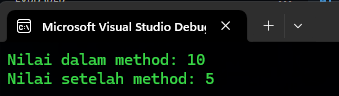

### Fungsi dan Method di C#

#### 1. Pengenalan Fungsi dan Method

**Fungsi (Function)** dan **Method** adalah blok kode yang dapat digunakan kembali untuk melakukan tugas tertentu. Di C#, istilah "method" lebih sering digunakan, tetapi konsepnya sama. Sebuah method bisa menerima input (*parameter*) dan dapat mengembalikan output.

##### Contoh 1: Method Sederhana Tanpa Parameter dan Pengembalian Nilai
```csharp
using System;

namespace PengenalanFungsi
{
    class Program
    {
        // Method sederhana yang tidak menerima parameter dan tidak mengembalikan nilai
        static void Sapa()
        {
            Console.WriteLine("Halo, selamat datang di C#!"); // Mencetak pesan ke konsol
        }

        static void Main(string[] args)
        {
            Sapa(); // Memanggil method Sapa
        }
    }
}
```


**Penjelasan:** Method `Sapa()` adalah method sederhana yang mencetak pesan ke konsol. Method ini tidak menerima parameter dan tidak mengembalikan nilai.

##### Contoh 2: Method dengan Parameter
```csharp
using System;

namespace MethodDenganParameter
{
    class Program
    {
        // Method yang menerima parameter nama
        static void Sapa(string nama)
        {
            Console.WriteLine($"Halo, {nama}! Selamat datang di C#!"); // Mencetak pesan dengan nama
        }

        static void Main(string[] args)
        {
            Sapa("Andi"); // Memanggil method Sapa dengan parameter "Andi"
            Sapa("Budi"); // Memanggil method Sapa dengan parameter "Budi"
        }
    }
}
```


**Penjelasan:** Method `Sapa()` menerima satu parameter `nama` dan menggunakan parameter tersebut untuk mencetak pesan yang dipersonalisasi ke konsol.

##### Contoh 3: Method dengan Pengembalian Nilai
```csharp
using System;

namespace MethodDenganReturn
{
    class Program
    {
        // Method yang menghitung penjumlahan dua angka dan mengembalikan hasilnya
        static int Jumlahkan(int a, int b)
        {
            return a + b; // Mengembalikan hasil penjumlahan
        }

        static void Main(string[] args)
        {
            int hasil = Jumlahkan(3, 4); // Memanggil method Jumlahkan dengan dua parameter
            Console.WriteLine($"Hasil penjumlahan: {hasil}"); // Mencetak hasil
        }
    }
}
```


**Penjelasan:** Method `Jumlahkan()` menerima dua parameter `a` dan `b`, menjumlahkannya, dan mengembalikan hasilnya. Nilai yang dikembalikan kemudian disimpan dalam variabel `hasil` dan dicetak.

##### Contoh 4: Method dengan Beberapa Parameter dan Pengembalian Nilai
```csharp
using System;

namespace MethodMultiParameter
{
    class Program
    {
        // Method yang menghitung rata-rata dari tiga angka
        static double RataRata(double a, double b, double c)
        {
            return (a + b + c) / 3; // Mengembalikan hasil rata-rata
        }

        static void Main(string[] args)
        {
            double hasil = RataRata(5.5, 7.0, 8.5); // Memanggil method RataRata
            Console.WriteLine($"Rata-rata: {hasil}"); // Mencetak hasil
        }
    }
}
```


**Penjelasan:** Method `RataRata()` menerima tiga parameter, menjumlahkan mereka, dan menghitung rata-rata. Hasil rata-rata dikembalikan dan dicetak ke konsol.

##### Contoh 5: Method dengan Parameter Opsional
```csharp
using System;

namespace ParameterOpsional
{
    class Program
    {
        // Method dengan parameter opsional
        static void Perkenalan(string nama, int umur = 18)
        {
            Console.WriteLine($"Halo, nama saya {nama} dan saya berumur {umur} tahun."); // Mencetak perkenalan
        }

        static void Main(string[] args)
        {
            Perkenalan("Andi"); // Memanggil method dengan parameter default
            Perkenalan("Budi", 25); // Memanggil method dengan parameter yang diberikan
        }
    }
}
```


**Penjelasan:** Method `Perkenalan()` memiliki parameter opsional `umur` dengan nilai default 18. Jika parameter `umur` tidak diberikan, maka nilai default akan digunakan.

---

#### 2. Perbedaan Fungsi/Method Pass by Reference dan Pass by Value

Dalam C#, parameter method bisa diteruskan ke method lain dengan dua cara: **Pass by Value** dan **Pass by Reference**.

- **Pass by Value:** Nilai parameter yang diteruskan ke method tidak mempengaruhi nilai asli dari variabel yang dipassing.
- **Pass by Reference:** Nilai parameter yang diteruskan ke method dapat mengubah nilai asli dari variabel yang dipassing.

##### Contoh 1: Pass by Value
```csharp
using System;

namespace PassByValue
{
    class Program
    {
        // Method yang menggunakan pass by value
        static void UbahNilai(int x)
        {
            x = 10; // Mengubah nilai x
            Console.WriteLine($"Nilai dalam method: {x}"); // Mencetak nilai x dalam method
        }

        static void Main(string[] args)
        {
            int angka = 5;
            UbahNilai(angka); // Memanggil method dengan pass by value
            Console.WriteLine($"Nilai setelah method: {angka}"); // Nilai asli tidak berubah
        }
    }
}
```


**Penjelasan:** Method `UbahNilai()` mengubah nilai parameter `x`, namun nilai asli `angka` dalam `Main()` tidak berubah karena pass by value.

##### Contoh 2: Pass by Reference
```csharp
using System;

namespace PassByReference
{
    class Program
    {
        // Method yang menggunakan pass by reference
        static void UbahNilai(ref int x)
        {
            x = 10; // Mengubah nilai x
            Console.WriteLine($"Nilai dalam method: {x}"); // Mencetak nilai x dalam method
        }

        static void Main(string[] args)
        {
            int angka = 5;
            UbahNilai(ref angka); // Memanggil method dengan pass by reference
            Console.WriteLine($"Nilai setelah method: {angka}"); // Nilai asli berubah
        }
    }
}
```


**Penjelasan:** Method `UbahNilai()` menggunakan kata kunci `ref`, sehingga perubahan pada parameter `x` juga mempengaruhi variabel `angka` dalam `Main()`.

##### Contoh 3: Menggunakan `out` untuk Pass by Reference
```csharp
using System;

namespace PassByReferenceOut
{
    class Program
    {
        // Method yang menggunakan out
        static void Hitung(out int hasil)
        {
            hasil = 25; // Menginisialisasi nilai hasil
        }

        static void Main(string[] args)
        {
            int angka;
            Hitung(out angka); // Memanggil method dengan out
            Console.WriteLine($"Nilai dari method: {angka}"); // Nilai asli diubah
        }
    }
}
```


**Penjelasan:** `out` juga digunakan untuk pass by reference. Bedanya, variabel `hasil` dalam method `Hitung()` harus diinisialisasi sebelum digunakan.

##### Contoh 4: Perbandingan Pass by Value dan Pass by Reference
```csharp
using System;

namespace PerbandinganPassBy
{
    class Program
    {
        // Method pass by value
        static void PassByValue(int x)
        {
            x = 10;
        }

        // Method pass by reference
        static void PassByReference(ref int x)
        {
            x = 10;
        }

        static void Main(string[] args)
        {
            int angka1 = 5;
            int angka2 = 5;

            PassByValue(angka1); // Pass by value
            PassByReference(ref angka2); // Pass by reference

            Console.WriteLine($"Pass by value: {angka1}"); // Nilai tidak berubah
            Console.WriteLine($"Pass by reference: {angka2}"); // Nilai berubah
        }
    }
}
```


**Penjelasan:** Contoh ini membandingkan hasil dari pass by value dan pass by reference. Pass by value tidak mengubah nilai asli, sementara pass by reference mengubahnya.

##### Contoh 5: Menggunakan Pass by Reference untuk Menukar Nilai
```csharp
using System;

namespace SwapExample
{
    class Program
    {
        // Method untuk menukar nilai dengan pass by reference
        static void Tukar(ref int a, ref int b)
        {
            int temp = a;
            a = b;
            b = temp;
        }

        static void Main(string[] args)
        {
            int angka1 = 3;
            int angka2 = 8;

            Console.WriteLine($"Sebelum tukar: angka1 = {angka1}, angka2 = {angka2}");
            Tukar(ref angka1, ref angka2); // Memanggil method untuk menukar
            Console.WriteLine($"Setelah tukar: angka1 = {angka1}, angka2 = {angka2}");
        }
    }
}
```


**Penjelasan:** Dalam contoh ini, method `Tukar()` menukar nilai dua variabel dengan menggunakan pass by reference.

---

#### 3. Apa Itu Fungsi Rekursif dan Implementasinya di C#?

**Fungsi Rekursif** adalah fungsi yang memanggil dirinya sendiri. Rekursi sering digunakan untuk memecahkan masalah yang dapat dipecah menjadi submasalah yang lebih kecil dengan pola yang sama.

##### Contoh 1: Rekursi Sederhana (Menghitung Faktorial)
```csharp
using System;

namespace RekursiFaktorial
{
    class Program
    {
        // Method rekursif untuk menghitung faktorial
        static int Faktorial(int n)
        {
            if (n == 0)
                return 1; // Basis kasus
            else
                return n * Faktorial(n - 1); // Pemanggilan rekursif
        }

        static void Main(string[] args)
        {
            int angka = 5;
            Console.WriteLine($"Faktorial dari {angka} adalah {Faktorial(angka)}");
        }
    }
}
```


**Penjelasan:** Method `Faktorial()` memanggil dirinya sendiri untuk menghitung faktorial dari `n`. Basis kasus terjadi ketika `n == 0`.

##### Contoh 2: Rekursi untuk Mencari Fibonacci
```csharp
using System;

namespace RekursiFibonacci
{
    class Program
    {
        // Method rekursif untuk menghitung bilangan Fibonacci
        static int Fibonacci(int n)
        {
            if (n == 0)
                return 0; // Basis kasus
            else if (n == 1)
                return 1; // Basis kasus
            else
                return Fibonacci(n - 1) + Fibonacci(n - 2); // Pemanggilan rekursif
        }

        static void Main(string[] args)
        {
            int angka = 6;
            Console.WriteLine($"Bilangan Fibonacci ke-{angka} adalah {Fibonacci(angka)}");
        }
    }
}
```


**Penjelasan:** Method `Fibonacci()` memanggil dirinya sendiri untuk menghitung bilangan Fibonacci ke-`n`. Basis kasus terjadi ketika `n == 0` atau `n == 1`.

##### Contoh 3: Rekursi untuk Mencari Pangkat
```csharp
using System;

namespace RekursiPangkat
{
    class Program
    {
        // Method rekursif untuk menghitung pangkat
        static int Pangkat(int a, int b)
        {
            if (b == 0)
                return 1; // Basis kasus
            else
                return a * Pangkat(a, b - 1); // Pemanggilan rekursif
        }

        static void Main(string[] args)
        {
            int angka = 2;
            int pangkat = 3;
            Console.WriteLine($"{angka} pangkat {pangkat} adalah {Pangkat(angka, pangkat)}");
        }
    }
}
```


**Penjelasan:** Method `Pangkat()` menghitung `a` dipangkatkan dengan `b` menggunakan rekursi. Basis kasus terjadi ketika `b == 0`.

##### Contoh 4: Rekursi dengan Dua Basis Kasus
```csharp
using System;

namespace RekursiDuaBasisKasus
{
    class Program
    {
        // Method rekursif dengan dua basis kasus
        static int GanjilGenap(int n)
        {
            if (n == 0)
                return 0; // Basis kasus ganjil
            else if (n == 1)
                return 1; // Basis kasus genap
            else
                return GanjilGenap(n - 2); // Pemanggilan rekursif
        }

        static void Main(string[] args)
        {
            int angka = 5;
            Console.WriteLine($"Ganjil/Genap dari {angka} adalah {GanjilGenap(angka)}");
        }
    }
}
```


**Penjelasan:** Method `GanjilGenap()` memeriksa apakah `n` adalah ganjil atau genap menggunakan dua basis kasus dalam rekursi.

##### Contoh 5: Rekursi dengan Kondisi Awal
```csharp
using System;

namespace RekursiAwal
{
    class Program
    {
        // Method rekursif dengan kondisi awal
        static void HitungMundur(int n)
        {
            if (n == 0)
                Console.WriteLine("Selesai!");
            else
            {
                Console.WriteLine(n);
                HitungMundur(n - 1); // Pemanggilan rekursif
            }
        }

        static void Main(string[] args)
        {
            int angka = 5;
            HitungMundur(angka);
        }
    }
}
```


**Penjelasan:** Method `HitungMundur()` melakukan hitung mundur dari `n` ke 0. Basis kasus terjadi ketika `n == 0`, di mana rekursi berhenti dan mencetak "Selesai!".